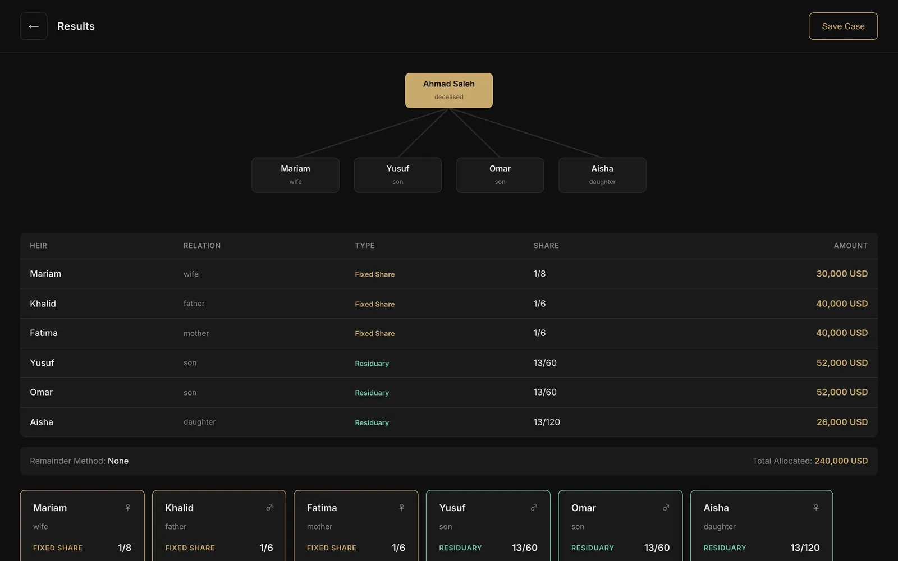

<div dir="rtl">

# ميراث (Mirath)

حاسبة للمواريث الإسلامية (علم الفرائض) وفق المذاهب السنية الأربعة: الحنفي والمالكي
والشافعي والحنبلي. تُدخل بيانات المتوفى والتركة والورثة الأحياء، فيحدد البرنامج
من يُحجب، ومن يرث بالفرض، ومن يرث بالتعصيب، ويطبّق العول أو الرد إذا لم تساوِ
الفروض التركة كاملة. تبقى الأنصبة كسورًا دقيقة إلى أن تُقسم الأموال.

> **English:** [README.md](README.md)

**الحالة: قيد التطوير.** محرك الحساب هو الجزء المكتمل والمختبَر. أما التطبيقات
المحيطة به فمبنية جزئيًا، ويوضح الجدول التالي ما يعمل اليوم وما لا يعمل.



## ما الذي يعمل اليوم

| الجزء | المسار | الحالة |
| --- | --- | --- |
| محرك الحساب | `packages/core` | **يعمل.** تنجح 67 اختبارًا. |
| مكونات الواجهة المشتركة | `packages/ui` | تعمل: نموذج القضية، وبطاقات الورثة، وجدول الأنصبة، وشجرة العائلة. |
| تطبيق سطح المكتب | `apps/app` | واجهة React تعمل وتحسب محليًا باستخدام المحرك. جانب Tauri (لغة Rust) لا يُترجم بعد. |
| الموقع التسويقي | `apps/marketing` | يُبنى بنجاح. صفحات بالعربية والإنجليزية مع سعر لمرة واحدة. |
| خادم التراخيص | `apps/license-server` | يُصدر تراخيص موقّعة بمفتاح Ed25519 ومربوطة بالجهاز، مع نقاط للحالة والإلغاء والإحصاءات والقائمة. لا يتحقق من الدفع بعد: يقبل أي رمز شراء لم يُستخدم. |
| لوحة الإدارة | `apps/admin` | صفحة Next.js تعرض التراخيص. تُبنى بنجاح، ويُظهر `tsc` خطأً واحدًا. |
| نسخة الويب | `apps/web` | واجهة فقط. ترسل إلى مسار `/calculate` غير موجود في خادم التراخيص، وطلب التفعيل فيها ينقصه حقول يطلبها الخادم، فلا تتجاوز شاشة الترخيص. |
| تقارير PDF | `packages/pdf` | تُبنى بنجاح. لا يستخدمها أي تطبيق بعد. |
| تقارير DOCX | `packages/docx` | لا تُبنى (استيراد غير مستخدم يُفشل `noUnusedLocals`). لا يستخدمها أي تطبيق بعد. |
| ملفات `.mirath` | `packages/mirath-format` | JSON مضغوط ومشفّر بـ AES-256-GCM. لا تُبنى على TypeScript 5.9 (أنواع `Uint8Array`). لا يستخدمها أي تطبيق بعد. |
| الترجمة | `packages/i18n` | النصوص العربية والإنجليزية موجودة لكنها لا تُحمَّل (انظر أدناه)، فتظهر التطبيقات بالإنجليزية. |

## محرك الحساب

`packages/core` مكتوب بـ TypeScript دون أي اعتماديات وقت التشغيل. تأخذ الدالة
`calculate()` القضية وتعيد نصيب كل وارث وسببه ومقداره من المال.

يعمل بهذا الترتيب:

1. **الحجب:** يستبعد الورثة المحجوبين بمن هو أقرب منهم، مع القواعد التي تختلف
   بين المذاهب (كالجد لأب والجدات).
2. **الفروض:** الزوجان، والأبوان، والبنات، وبنات الابن، والأخوات، والإخوة لأم،
   ومنها مسألتا العُمَريّتين.
3. **العصبات:** الأبناء، والإخوة، وأبناء الإخوة، والأعمام، وللذكر مثل حظ
   الأنثيين حيث تنطبق القاعدة.
4. **العول أو الرد:** تُخفَّض الأنصبة إذا زادت الفروض على التركة، أو يُرد الفائض
   على المستحقين إذا لم يوجد عاصب.

تغطي الاختبارات كل خطوة من هذه الخطوات، ومسألة الجد مع الإخوة التي اختلف فيها
المذاهب، والورثة المتوفين قبل المورِّث، والتركات التي لها وارث واحد، وعددًا من
الأسر المركبة، وتتحقق من المبالغ إلى جانب الكسور.

## المتطلبات

- Node.js 20 أو أحدث
- pnpm 9
- Rust، فقط لغلاف Tauri لسطح المكتب

## التشغيل

```bash
pnpm install
```

اختبارات المحرك (لا يوجد سكربت `test` في جذر المشروع):

```bash
pnpm --filter @mirath/core test
```

واجهة تطبيق سطح المكتب في المتصفح على المنفذ 1420:

```bash
cd apps/app && npx vite --port 1420
```

خارج Tauri لا يجد فحص الترخيص ما يتصل به، فيتوقف التطبيق عند شاشة التفعيل.

الموقع التسويقي على المنفذ 4321:

```bash
pnpm --filter @mirath/marketing dev
```

خادم التراخيص على المنفذ 3001. يحتاج إلى ملف `apps/license-server/.env`: انسخ
`.env.example`، وضع في `ADMIN_TOKEN` نصًا عشوائيًا (تُرسله طلبات الإدارة في
`Authorization: Bearer …`)، وضع في `ED25519_PRIVATE_KEY` مفتاحًا بصيغة base64 DER
(PKCS#8)، ويطبعه هذا الأمر:

```bash
node -e "console.log(require('crypto').generateKeyPairSync('ed25519').privateKey.export({format:'der',type:'pkcs8'}).toString('base64'))"
mkdir -p apps/license-server/data
pnpm --filter @mirath/license-server dev
```

لوحة الإدارة:

```bash
pnpm --filter @mirath/admin dev
```

يشغّل `pnpm dev` من الجذر كل الحزم عبر Turborepo، لكن تطبيق سطح المكتب يفشل في
هذا التشغيل (انظر أدناه).

## مشكلات معروفة

- **Tauri لا يُترجم.** في `apps/app/src-tauri/src/commands.rs` يُحوَّل `FilePath`
  من إضافة الحوارات إلى `PathBuf` باستخدام `.into()`، وهذا لم يعد مدعومًا في
  `tauri-plugin-dialog` 2 (المطلوب `into_path()`).
- **أوامر Tauri قبل التشغيل والبناء تستدعي نفسها.** في
  `apps/app/src-tauri/tauri.conf.json` قيمة `beforeDevCommand` هي
  `pnpm dev --filter …` وقيمة `beforeBuildCommand` هي `pnpm build --filter …`،
  وعند تشغيلهما من `apps/app` تبدآن `tauri dev` و`tauri build` من جديد بدل Vite.
- **الترجمة لا تُحمَّل.** تقرأ `setupI18n` القيمة `{ messages }` من ملف اللغة،
  لكن الملفات قوائم مفاتيح وقيم مسطحة بلا مفتاح `messages`، فيرمي Lingui خطأً
  ولا تُستخدم النصوص العربية.
- **`pnpm typecheck` يفشل** في `admin`، و`app` (لا توجد تعريفات أنواع لوحدات CSS)،
  و`docx`، و`license-server` (أنواع موجّهات مستنتجة لا يمكن تسميتها)،
  و`mirath-format`.
- **لا يوجد ربط بالدفع بعد.** الخطة هي Stripe وx402/USDC، والخادم يكتفي بتسجيل
  أيهما يشبه رمز الشراء.

## هيكل المشروع

```
apps/
  app/             تطبيق Tauri 2 + React لسطح المكتب والأجهزة اللوحية
  web/             نسخة الويب (React + Vite) خلف الترخيص
  admin/           لوحة إدارة التراخيص (Next.js 14)
  marketing/       موقع Astro بالعربية والإنجليزية
  license-server/  واجهة تفعيل التراخيص (Express + SQLite)
packages/
  core/            محرك حساب المواريث
  ui/              مكونات React مشتركة تدعم RTL
  i18n/            النصوص العربية والإنجليزية (Lingui)
  pdf/             تقارير PDF (pdfmake)
  docx/            تقارير DOCX (docxtemplater)
  mirath-format/   ترميز ملفات .mirath
```

يحتوي `context.md` على ملاحظات التصميم كاملة: صيغة الترخيص، وصيغة الملفات،
ونموذج العمل.

## الأمان

تُوقَّع التراخيص بمفتاح Ed25519 لا يملكه إلا خادم التراخيص، ويتحقق منها التطبيق
بالمفتاح العام وبصمة العتاد. احفظ مفتاح التوقيع ورمز الإدارة ومسارات قاعدة
البيانات في ملفات `.env` محلية مستبعدة من Git، ولا تضعها في المستودع أبدًا.

</div>
